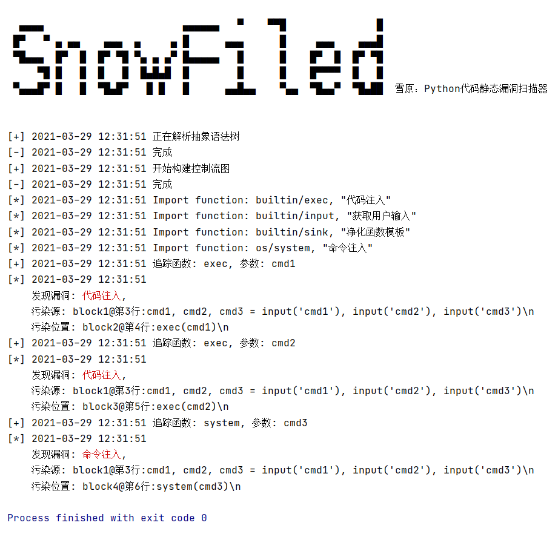

# SnowField 雪原



## 扫描器结构设计

扫描器由六个组件构成：

- cfgEngine：负责从抽象语法树构建控制流图
- fixEngine：预置一些对扫描出的风险点去风险的解决方案
- logEngine：提供有不同特性的log函数，如控制台log，文件log，邮箱提醒扫描结果等
- moduleEngine：python以module为单位组织程序，扫描器也以module为单位构建控制流图，moduleEngine即是负责提供module建模，模型存储以及扫描时的模型导入等的功能
- scanEngine：负责根据控制流图进行污点追踪
- testEngine：集成开发中需要的测试功能，记录测试结果以便于扫描器迭代开发

## 抽象语法树的生成

我的扫描器使用python内置的库ast来生成抽象语法树，抽象语法树的各类细节参考官方文档：https://docs.python.org/3/library/ast.html

## 控制流图的构建

控制流图由两个要素组成：

- 基本块（Basic Block）：不包含任何分支逻辑的代码块
- 边（Link）：连接具有逻辑分支关系的基本块

### 数据结构

#### 基本块：

```
id: 标识基本块的整数
statements: 基本模块中包含的代码列表
func_calls: 基本块中调用到的函数的列表
predecessors: 连接基本块与其父节点的边的列表
exits: 连接基本块与其子节点的边的列表
```

#### 边：

```
source: 边的出发基本块
target: 边的目的基本块
exitcase: 边所代表的分支逻辑
```

#### 控制流图：

```
name: 控制流图的名字
entryblock: 控制流图的逻辑起点，进入控制流图的第一个基本块（程序入口）
finalblocks: 控制流图可能到达的逻辑终点，程序出口
functioncfgs: 控制流图的子图（调用的函数的控制流图，这样设计的目的是防止控制流图重复包含函数的内部逻辑而变得过于庞大）
```

### 构建方法

#### AST node的处理：

#### 递归构建：

- function-subCFG
- file-subCFG
- package-subCFG

#### 分割基本块：


## 建模

### 模型结构

#### 净化函数 sinkFunc

```
{
  "sink": {
    "description": "净化函数模板"
    "vector": []
  }
}
```

#### 易污染函数 taintedFunc

```
{
  "exec": {
    "description": "可能存在命令注入漏洞"
    "vector": []
  }
}
```

#### 污染源函数 taintSource

```
{
  "input": {
    "description": "获取用户输入"
    "vector": []
  }
}
```

### 建模对象

- Python内置函数
- Python Package
- Python项目中的mudule/file

### 自动建模

#### 必要性：

Python项目依赖的module可能非常多，超出扫描器内置模型的范围。Python现有Package数量之多也使得人工构建完备的模型数据库工作量极大。

#### 可行性与局限性：

- file-subCFG
- package-subCFG

在对内置函数充分建模的前提下，可以通过污点追踪技术本身对未知目标进行易污染函数和污染源函数的建模。对于净化函数则难以准确建模。

## 污点追踪


